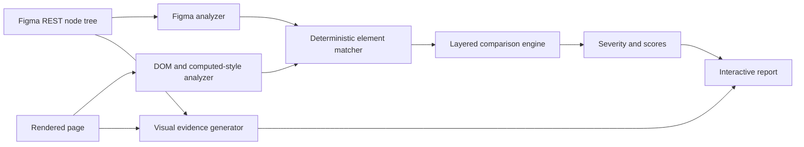

# Design QA architecture

## Pipeline

The structured comparison is the source of issues and scores. Pixel output is labeled as supporting evidence and is never used to assign an issue or severity.

## Modules

| Module | Responsibility |
| --- | --- |
| `figma-analyzer.js` | Normalize the selected Figma frame into hierarchy, roles, geometry, auto-layout, typography, visual styles, component metadata, and variable names. |
| `website-analyzer.js` | Measure visible DOM nodes, semantic roles, selectors, hierarchy, text glyph bounds, layout, computed typography, and visual styles. |
| `matcher.js` | Produce deterministic one-to-one Figma/DOM matches and confidence values. |
| `comparison-engine.js` | Run structure, geometry, spacing, typography, visual, and content checks. |
| `scoring.js` | Turn check quality into category and overall scores. |
| `visual-artifacts.js` | Normalize reference images and create overlay and filtered difference-map evidence. |
| `runner.js` | Coordinate the model, report, JSON output, and issue-only image annotations. |

## Normalized model

Each meaningful node records:

- Stable source ID, parent ID, depth, order, name, type, and inferred semantic role.
- Direct text and descendant text anchors.
- Viewport-relative `x`, `y`, `width`, and `height`.
- Layout mode, padding, gap, margins, alignment, constraints, and available token names.
- Font family, size, weight, line height, letter spacing, alignment, and measured line count.
- Solid background/text/border colors, border width, radius, opacity, and shadow presence.
- Website selector and accessibility metadata, or Figma component/instance metadata.

Figma coordinates are translated from the selected frame origin and scaled to the requested viewport. The page is rendered at that viewport. Text nodes use browser Range bounds so a stretched flex child does not produce a false text-width issue.

Header/footer exclusion filters both trees while keeping the rendered page intact. This preserves page layout and prevents excluded regions from shifting the remaining measurements.

## Matching and confidence

Candidate scores use four deterministic signals:

| Signal | Weight | Notes |
| --- | ---: | --- |
| Direct or descendant text | 44% | Exact normalized text scores 1; other text uses token Jaccard similarity. |
| Semantic role | 24% | Exact roles score 1; compatible role families score 0.6. |
| Geometry | 24% | Center distance and width/height similarity at the selected viewport. |
| Solid color | 8% | Background or text color distance. |

Exact text gets a confidence floor before hierarchy evaluation. Candidates are sorted by score and assigned greedily as one-to-one pairs. A correct matched-parent relationship contributes 10% to the final score. Geometry disambiguates repeated labels and repeated component instances.

The balanced minimum match score is `0.52`. Confidence at or above `72%` is reported as `confirmed`; lower-confidence comparisons are marked `needs review`. Unmatched meaningful nodes become explicit missing or unexpected structure issues.

## Comparison layers

### Structure

- Missing and unexpected meaningful elements.
- Wrong component or DOM ownership when a child is matched under a different parent.
- Component coverage from matched, missing, and unexpected interactive/component roles.

### Geometry and responsive layout

- Width and height.
- Position relative to the matched parent rather than only global page coordinates.
- Viewport-specific normalization for desktop, tablet, mobile, custom, or Figma-frame dimensions.

A parent auto-layout spacing defect can move its children. When that movement is fully explained by the parent gap or padding issue, the child offset is suppressed so the report shows the root cause once.

### Spacing and alignment

- Padding on all four sides.
- Auto-layout/flex/grid item gap.
- Primary and cross-axis alignment.
- Vertical relationships between adjacent matched siblings when the parent has no explicit auto-layout model.
- Figma variable names and website CSS token names when available.

### Typography

- Font family, size, weight, line height, letter spacing, text alignment, and line count.
- Different wrapping is measured through line count and geometry.

### Visual styles

- Solid background, text, and border colors.
- Border width, corner radius, opacity, and shadow presence.
- Exact expected and actual colors are reported as hex values.

### Content

- Direct normalized text changes on matched elements.
- The dedicated Wording mode remains available for detailed section and phrase analysis.

## Balanced tolerances

| Measurement | Default tolerance |
| --- | ---: |
| Relative position | 4 px |
| Width or height | 4 px and 3% |
| Padding/gap | 2 px |
| Font size | 1 px |
| Line height | 2 px |
| Letter spacing | 0.5 px |
| Font weight | 100 |
| Border width | 1 px |
| Corner radius | 2 px |
| RGB Euclidean color distance | 18 |
| Opacity | 0.05 |

The UI also exposes strict and relaxed profiles. API callers can override allowlisted numeric thresholds for an individual run.

## Severity

Severity is deterministic:

- Missing buttons, inputs, and dialogs are critical. Missing cards, components, headers, and footers are major.
- Geometry is critical at 40 px or 25% deviation, major at 12 px or 8%, and minor below that.
- Spacing is critical at 16 px, major at 6 px, and minor below that.
- Typography is major from a 4-unit maximum property deviation; smaller differences are minor.
- Visual color/style distance is major from 45; smaller failures are minor.

Severity describes impact. Confidence describes match certainty. They are separate fields.

## Scoring

Each deterministic property check produces a quality value from `0` to `1` based on its deviation and tolerance. A category score is the arithmetic mean of its checks. The overall alignment score is the weighted mean:

| Category | Weight |
| --- | ---: |
| Structure | 24% |
| Geometry/layout | 22% |
| Spacing | 18% |
| Typography | 16% |
| Colors and visual styles | 14% |
| Content | 6% |

Component score is reported separately as the F1 score of component precision and recall. The report stores its check count, weights, average match confidence, and explanation so a score can be audited.

## Visual evidence

The report contains:

- Side-by-side normalized Figma and website images.
- An adjustable 50% overlay.
- A difference map that filters small per-pixel differences using the configured pixel threshold.
- Separate issue-only annotated images for the website and Figma regions.

Pixel differences are useful for inspection but can be caused by font rendering, anti-aliasing, image encoding, or animation. They do not affect structured scores.

## Known limitations

- Figma variable names are best effort. Files or accounts without Variables API access fall back to numeric values and website CSS-token resolution.
- Gradients, blend modes, masks, complex effects, and shadow parameter equality are not fully modeled. Shadow presence is checked.
- Icons, arbitrary vectors, canvas content, video frames, cross-origin iframes, and image subject similarity need specialized visual or accessibility metadata for strong semantic matching.
- Font availability and browser font rasterization can affect text geometry even when CSS declarations agree.
- Greedy matching is deterministic and explainable, but deeply repeated layouts with identical content, roles, geometry, and colors may need stable component IDs or test IDs for perfect identity.
- The tool validates one rendered viewport and state per run. Responsive breakpoints and interactive states require separate runs.

## Ground-truth verification

`npm test` covers perfect matches and controlled defects for spacing, typography, color, shadow presence, missing critical components, extra cards, hierarchy, relative position, sibling relationships, changed content with low confidence, repeated labels, and responsive geometry. Browser integration tests cover all modes, header/footer inclusion, single-mode validation, scoring, issue cards, issue highlighting, overlays, and difference maps.
